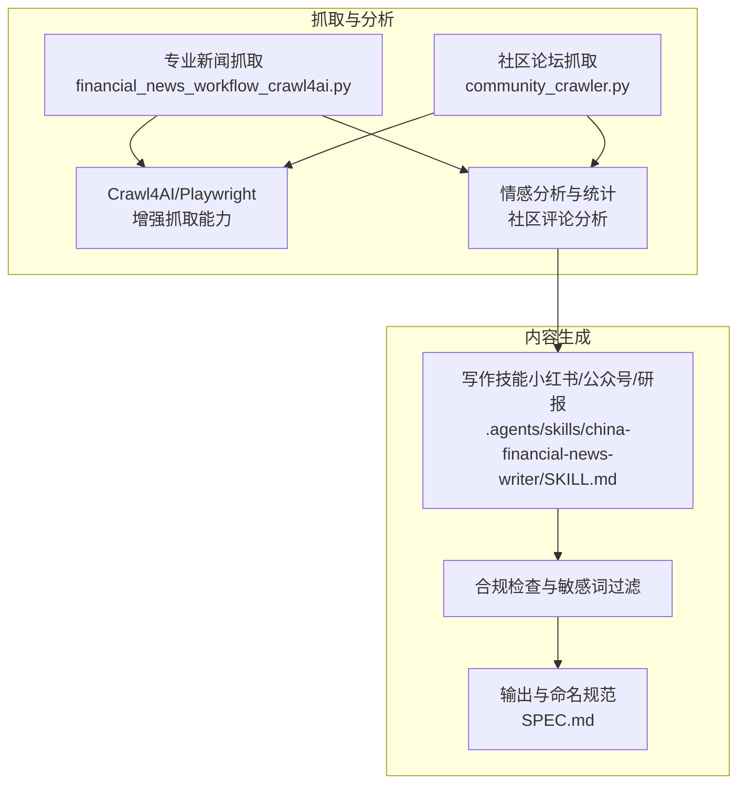
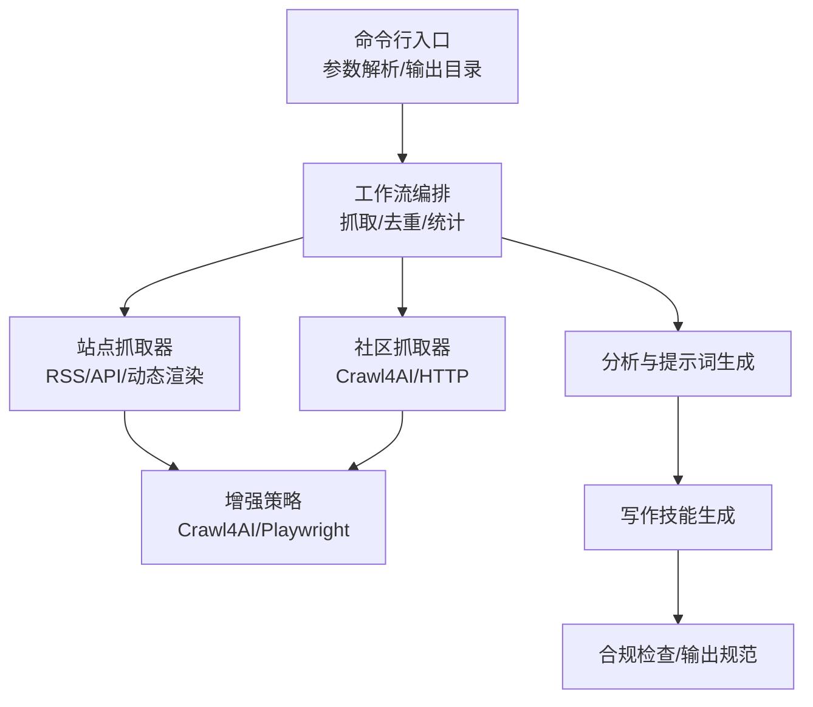
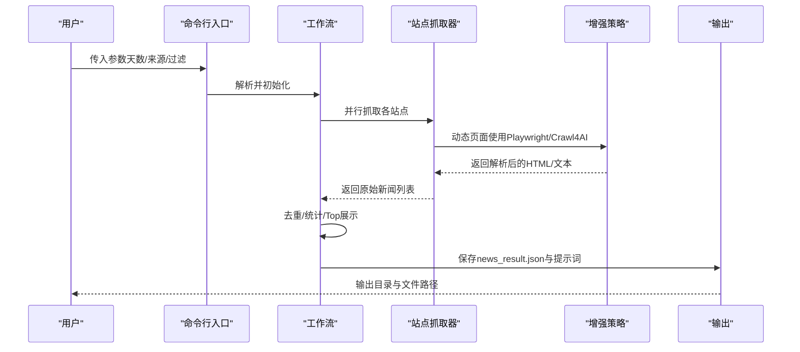
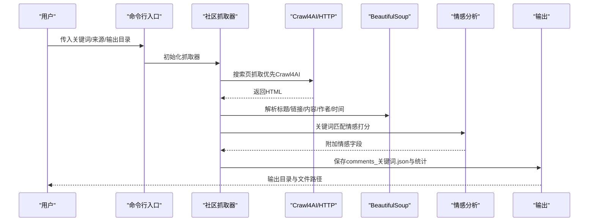
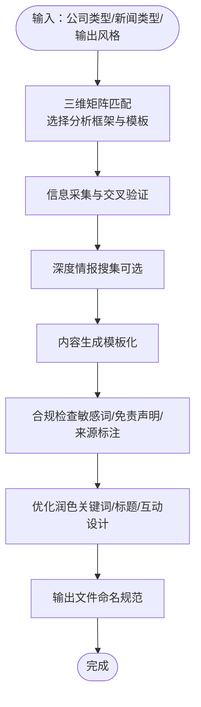
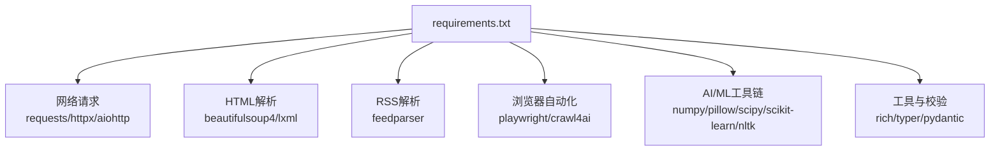

# 设计理念

<cite>
**本文引用的文件**
- [design_philosophy.md](file://design/design_philosophy.md)
- [RUN.md](file://docs/RUN.md)
- [SPEC.md](file://docs/SPEC.md)
- [CHANGELOG.md](file://docs/CHANGELOG.md)
- [requirements.txt](file://requirements.txt)
- [financial_news_workflow_crawl4ai.py](file://financial_news_workflow_crawl4ai.py)
- [community_crawler.py](file://community_crawler.py)
- [test_all_sources.py](file://test_all_sources.py)
- [test_crawl4ai.py](file://test_crawl4ai.py)
- [SKILL.md](file://.agents/skills/china-financial-news-writer/SKILL.md)
</cite>

## 目录
1. [引言](#引言)
2. [项目结构](#项目结构)
3. [核心组件](#核心组件)
4. [架构总览](#架构总览)
5. [详细组件分析](#详细组件分析)
6. [依赖分析](#依赖分析)
7. [性能考量](#性能考量)
8. [故障排查指南](#故障排查指南)
9. [结论](#结论)
10. [附录](#附录)

## 引言
本设计理念文档围绕 Redbook 系统的“自动化优先、AI赋能、合规导向”展开，系统性阐述项目的设计哲学、核心价值观与落地实践。Redbook 以“金融新闻自动化工作流”为核心，结合社区舆情抓取与基础内容分析，形成从“选题发现—信息聚合—分析提示—内容生成”的闭环，既强调工程效率与稳定性，又重视内容质量与合规边界。

- 自动化优先：通过统一的脚本化工作流、多源并行抓取与可配置输出，最大化降低人工干预，提升规模化产出能力。
- AI赋能：在抓取阶段引入 Crawl4AI 与 Playwright，在内容生成阶段引入写作技能与合规检查，实现“抓取+分析+生成”的智能化升级。
- 合规导向：在内容生成环节内置敏感词检测、免责声明与数据来源标注，确保内容在传播与使用层面满足合规要求。

## 项目结构
Redbook 采用“脚本驱动 + 技能封装 + 文档规范”的组织方式，核心由两条主线构成：
- 抓取与分析主线：专业新闻抓取、社区评论抓取、情感分析与提示词生成。
- 内容生成主线：基于写作技能的模板化生成、合规检查与风格适配。

**图表来源**
- [financial_news_workflow_crawl4ai.py:1-454](file://financial_news_workflow_crawl4ai.py#L1-L454)
- [community_crawler.py:1-604](file://community_crawler.py#L1-L604)
- [SKILL.md:1-476](file://.agents/skills/china-financial-news-writer/SKILL.md#L1-L476)
- [SPEC.md:1-183](file://docs/SPEC.md#L1-L183)

**章节来源**
- [RUN.md:1-252](file://docs/RUN.md#L1-L252)
- [SPEC.md:1-183](file://docs/SPEC.md#L1-L183)

## 核心组件
- 专业新闻抓取器：面向权威财经媒体，支持 RSS/API/动态渲染等多种站点，具备去重、统计与可配置输出能力。
- 社区论坛抓取器：面向雪球、知乎等平台，支持 Crawl4AI 增强抓取与传统 HTTP 抓取双通道，内置情感分析与统计。
- 写作技能：提供三维分类矩阵（公司类型×新闻类型×输出风格）与合规检查，支撑多平台内容生成。
- 工具链与依赖：以 requirements.txt 管理依赖，涵盖网络请求、异步处理、解析库、Crawl4AI、AI/ML 工具链等。

**章节来源**
- [financial_news_workflow_crawl4ai.py:94-358](file://financial_news_workflow_crawl4ai.py#L94-L358)
- [community_crawler.py:197-410](file://community_crawler.py#L197-L410)
- [SKILL.md:24-52](file://.agents/skills/china-financial-news-writer/SKILL.md#L24-L52)
- [requirements.txt:1-144](file://requirements.txt#L1-L144)

## 架构总览
系统采用“分层解耦 + 多策略并行”的架构设计：
- 表现层：命令行入口（参数解析与输出目录管理）。
- 业务层：抓取器与分析器（按站点/社区抽象为独立模块）。
- 增强层：Crawl4AI 与 Playwright 提升复杂页面抓取成功率。
- 规范层：需求文档与运行文档定义流程、输出与验收标准。

**图表来源**
- [financial_news_workflow_crawl4ai.py:405-454](file://financial_news_workflow_crawl4ai.py#L405-L454)
- [community_crawler.py:501-596](file://community_crawler.py#L501-L596)
- [SPEC.md:98-112](file://docs/SPEC.md#L98-L112)

## 详细组件分析

### 专业新闻抓取器（自动化优先）
- 设计要点
  - 多源适配：针对 RSS、API、动态渲染分别采用 feedparser、requests、Playwright，保证覆盖面与稳定性。
  - 可配置过滤：支持按“近X天”和“公司名”过滤，便于聚焦热点。
  - 去重与统计：统一去重、按来源统计、Top 展示，提升信息密度。
  - 输出规范：统一 JSON 结构与时间戳目录，便于后续分析与归档。
- 平衡效率与准确性
  - 通过“多策略并行 + 失败降级”（如 Playwright 失败回退至 requests）提升成功率；对动态页面采用 Playwright，静态/轻量页面采用 requests，兼顾吞吐与资源消耗。
- 大规模数据处理
  - 采用集合去重与增量统计，避免重复处理；对 HTML 解析与正则匹配进行边界控制，防止内存膨胀。

**图表来源**
- [financial_news_workflow_crawl4ai.py:363-450](file://financial_news_workflow_crawl4ai.py#L363-L450)

**章节来源**
- [financial_news_workflow_crawl4ai.py:94-358](file://financial_news_workflow_crawl4ai.py#L94-L358)
- [RUN.md:50-84](file://docs/RUN.md#L50-L84)

### 社区论坛抓取器（AI赋能与合规）
- 设计要点
  - 双通道抓取：优先使用 Crawl4AI + Playwright 处理复杂页面，失败时回退至 requests，提升鲁棒性。
  - 情感分析：基于关键词匹配进行粗粒度情感打分，辅助判断用户情绪与舆论风向。
  - 输出与统计：按来源与情感分组统计，便于后续内容策略制定。
- 平衡效率与准确性
  - 对每个站点限定抓取数量上限与超时阈值，避免单点阻塞；对 HTML 解析采用健壮的异常捕获与选择器容错。
- 大规模数据处理
  - 使用缓存与增量统计，避免重复抓取；对评论内容进行清洗与截断，控制输出体积。

**图表来源**
- [community_crawler.py:127-176](file://community_crawler.py#L127-L176)
- [community_crawler.py:179-194](file://community_crawler.py#L179-L194)
- [community_crawler.py:444-466](file://community_crawler.py#L444-L466)

**章节来源**
- [community_crawler.py:197-410](file://community_crawler.py#L197-L410)
- [community_crawler.py:444-497](file://community_crawler.py#L444-L497)
- [RUN.md:85-112](file://docs/RUN.md#L85-L112)

### 内容生成与合规（AI赋能与合规导向）
- 设计要点
  - 三维分类矩阵：公司类型×新闻类型×输出风格，自动匹配写作框架与模板。
  - 合规检查：内置敏感词扫描、投资建议合规提示与数据来源标注，降低法律与传播风险。
  - 输出规范：统一命名规则与文件夹结构，便于版本管理与二次加工。
- 平衡效率与准确性
  - 通过模板化与模块化组合，快速生成初稿；在合规检查阶段集中修正，避免反复返工。
- 大规模数据处理
  - 以“事件+分析+对比+技术+故事+互动”为主线，控制篇幅与结构复杂度，提升可读性与传播效果。

**图表来源**
- [SKILL.md:24-52](file://.agents/skills/china-financial-news-writer/SKILL.md#L24-L52)
- [SKILL.md:151-237](file://.agents/skills/china-financial-news-writer/SKILL.md#L151-L237)
- [SKILL.md:249-267](file://.agents/skills/china-financial-news-writer/SKILL.md#L249-L267)
- [SKILL.md:268-287](file://.agents/skills/china-financial-news-writer/SKILL.md#L268-L287)
- [SPEC.md:286-354](file://docs/SPEC.md#L286-L354)

**章节来源**
- [SKILL.md:11-22](file://.agents/skills/china-financial-news-writer/SKILL.md#L11-L22)
- [SPEC.md:130-149](file://docs/SPEC.md#L130-L149)

## 依赖分析
- 核心依赖：requests/httpx/aiohttp、feedparser、beautifulsoup4/lxml、playwright/crawl4ai 等，覆盖网络请求、异步并发、RSS/HTML 解析与浏览器自动化。
- 增强依赖：Crawl4AI 与 AI/ML 工具链（numpy/pillow/scipy/scikit-learn/nltk 等），用于内容理解与向量化处理。
- 工具链：rich/pygments、typer/click、pydantic/jsonschema 等，提升交互体验与数据校验。

**图表来源**
- [requirements.txt:6-129](file://requirements.txt#L6-L129)

**章节来源**
- [requirements.txt:1-144](file://requirements.txt#L1-L144)

## 性能考量
- 并行与降级：多源并行抓取，动态页面优先使用 Playwright/Crawl4AI，失败回退至 requests，保障成功率与吞吐。
- 资源控制：对页面抓取数量与超时进行限制，避免单点阻塞；对 HTML 解析与正则匹配进行边界控制，防止内存膨胀。
- 输出与缓存：统一时间戳目录与 JSON 结构，便于后续分析与归档；对重复内容进行去重，减少冗余。
- 可观测性：通过命令行日志与输出文件路径，快速定位问题与评估性能。

**章节来源**
- [financial_news_workflow_crawl4ai.py:363-450](file://financial_news_workflow_crawl4ai.py#L363-L450)
- [community_crawler.py:127-176](file://community_crawler.py#L127-L176)
- [community_crawler.py:179-194](file://community_crawler.py#L179-L194)
- [RUN.md:144-189](file://docs/RUN.md#L144-L189)

## 故障排查指南
- 抓取失败
  - 检查网络连接与目标站点可达性；缩小来源范围或缩短时间窗口；查看命令行输出的错误信息。
- Playwright 启动失败
  - 确保已执行浏览器安装命令；检查系统权限与管理员运行；必要时以管理员身份重试。
- 依赖安装失败
  - 升级 pip；尝试二进制安装；检查网络与镜像源；确认 Python 版本满足要求。
- Crawl4AI 功能异常
  - 确认已安装并可导入；检查网络与 API 配置；参考测试脚本进行最小化验证。

**章节来源**
- [RUN.md:144-189](file://docs/RUN.md#L144-L189)
- [test_crawl4ai.py:15-22](file://test_crawl4ai.py#L15-L22)
- [test_crawl4ai.py:121-163](file://test_crawl4ai.py#L121-L163)

## 结论
Redbook 的设计理念以“自动化优先、AI赋能、合规导向”为核心，通过脚本化工作流与多策略抓取，构建从“选题发现—信息聚合—分析提示—内容生成”的高效闭环。在工程层面，系统强调可扩展、可维护与可观测；在内容层面，强调合规与价值密度。未来可在“分布式抓取、自动更新监控、多语言支持、自定义规则与更多社区接入”等方面持续演进，进一步提升规模化与智能化水平。

## 附录
- 设计哲学参考：视觉传达与市场张力的“Flux Economics”理念，强调精准与克制的表达方式，可借鉴其“几何严谨、信号明确、能量张力”的视觉语言，指导内容结构与呈现节奏。
- 版本与演进：依据更新日志，系统在 v1.0.0 中新增 Crawl4AI 支持、社区抓取与情感分析，并优化异步与错误处理，体现了从“基础抓取”向“智能增强”的演进。

**章节来源**
- [design_philosophy.md:1-16](file://design/design_philosophy.md#L1-L16)
- [CHANGELOG.md:3-30](file://docs/CHANGELOG.md#L3-L30)