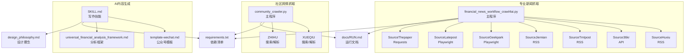
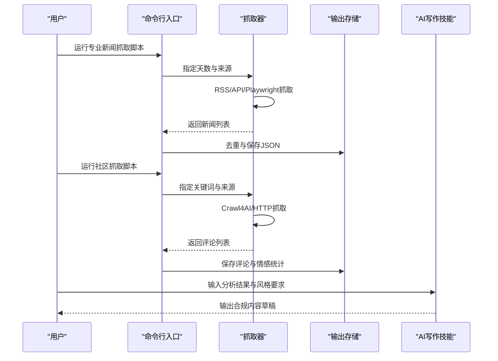
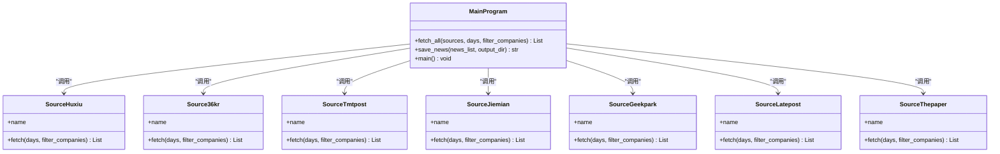
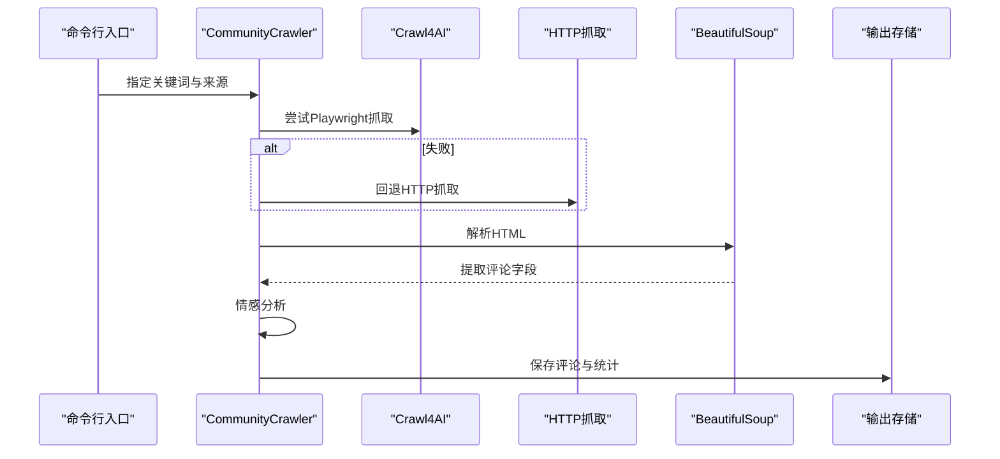
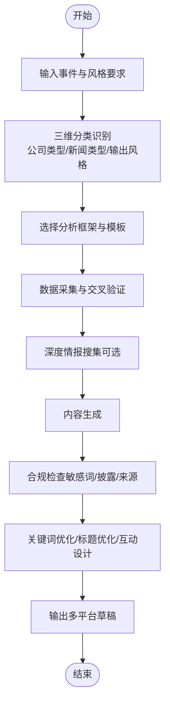
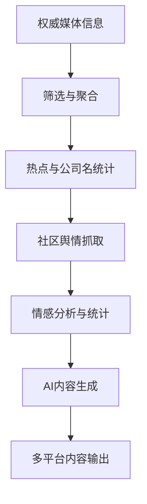
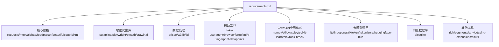

# 项目概述

<cite>
**本文引用的文件**
- [financial_news_workflow_crawl4ai.py](file://financial_news_workflow_crawl4ai.py)
- [community_crawler.py](file://community_crawler.py)
- [requirements.txt](file://requirements.txt)
- [RUN.md](file://docs/RUN.md)
- [design_philosophy.md](file://design/design_philosophy.md)
- [SKILL.md](file://.agents/skills/china-financial-news-writer/SKILL.md)
- [universal_financial_analysis_framework.md](file://.agents/skills/china-financial-news-writer/references/universal_financial_analysis_framework.md)
- [template-wechat.md](file://.agents/skills/china-financial-news-writer/references/template-wechat.md)
- [test_all_sources.py](file://test_all_sources.py)
- [test_crawl4ai.py](file://test_crawl4ai.py)
- [news_output\news_20260324_182234.json](file://news_output/news_20260324_182234.json)
</cite>

## 目录
1. [引言](#引言)
2. [项目结构](#项目结构)
3. [核心组件](#核心组件)
4. [架构总览](#架构总览)
5. [详细组件分析](#详细组件分析)
6. [依赖分析](#依赖分析)
7. [性能考虑](#性能考虑)
8. [故障排查指南](#故障排查指南)
9. [结论](#结论)
10. [附录](#附录)

## 引言
Redbook金融新闻自动化工作流系统是一个面向中国权威财经媒体的自动化内容采集与分析平台，旨在通过多源抓取、去重聚合、社区舆情分析与AI内容生成，帮助创作者与研究者快速锁定热点选题、提炼核心信息并生成面向不同平台风格的高质量内容。系统覆盖7大权威财经媒体，支持RSS、API与Playwright动态渲染等多种抓取方式，并内置Crawl4AI增强能力与金融写作技能，形成从“信息采集—分析—生成”的闭环。

## 项目结构
项目采用功能模块化与脚本化的组织方式，核心由两条主线组成：
- 专业新闻自动化工作流：从7大权威财经媒体抓取新闻，支持日期过滤、公司名过滤与输出归档。
- 社区论坛抓取与舆情分析：从雪球、知乎等社区抓取用户评论，进行情感分析与统计输出。
- AI内容生成与合规：提供金融新闻自动写作技能，支持不同公司类型、新闻类型与输出风格的组合生成，并内置敏感词检测与关键词优化。

**图示来源**
- [financial_news_workflow_crawl4ai.py:1-454](file://financial_news_workflow_crawl4ai.py#L1-L454)
- [community_crawler.py:1-604](file://community_crawler.py#L1-L604)
- [SKILL.md:1-476](file://.agents/skills/china-financial-news-writer/SKILL.md#L1-L476)
- [requirements.txt:1-144](file://requirements.txt#L1-L144)
- [RUN.md:1-252](file://docs/RUN.md#L1-L252)
- [design_philosophy.md:1-16](file://design/design_philosophy.md#L1-L16)

**章节来源**
- [RUN.md:3-18](file://docs/RUN.md#L3-L18)
- [requirements.txt:1-144](file://requirements.txt#L1-L144)

## 核心组件
- 专业新闻抓取器：封装7个媒体源的专用抓取逻辑，统一输出结构，支持去重与统计。
- 社区论坛抓取器：支持Crawl4AI与传统HTTP两种抓取策略，解析搜索结果并提取评论信息，进行情感分析。
- AI写作技能：提供三维分类矩阵（公司类型×新闻类型×输出风格）与万能分析框架，配套模板与合规检查。
- 运行与测试：提供完整的运行文档、依赖清单与测试脚本，便于快速部署与验证。

**章节来源**
- [financial_news_workflow_crawl4ai.py:94-358](file://financial_news_workflow_crawl4ai.py#L94-L358)
- [community_crawler.py:56-410](file://community_crawler.py#L56-L410)
- [SKILL.md:24-52](file://.agents/skills/china-financial-news-writer/SKILL.md#L24-L52)
- [universal_financial_analysis_framework.md:1-126](file://.agents/skills/china-financial-news-writer/references/universal_financial_analysis_framework.md#L1-L126)
- [template-wechat.md:1-518](file://.agents/skills/china-financial-news-writer/references/template-wechat.md#L1-L518)

## 架构总览
系统采用“抓取-聚合-分析-生成”的分层架构：
- 抓取层：多源适配（RSS/API/Requests/Playwright/Crawl4AI），应对不同网站结构与反爬策略。
- 数据层：统一JSON结构，包含来源、标题、链接、摘要、发布时间等字段，便于后续分析与生成。
- 分析层：社区情感分析、热点统计、公司名过滤（可选）。
- 生成层：AI写作技能与模板库，结合合规检查与关键词优化，输出面向不同平台的内容。

**图示来源**
- [financial_news_workflow_crawl4ai.py:405-454](file://financial_news_workflow_crawl4ai.py#L405-L454)
- [community_crawler.py:501-604](file://community_crawler.py#L501-L604)
- [SKILL.md:357-414](file://.agents/skills/china-financial-news-writer/SKILL.md#L357-L414)

## 详细组件分析

### 专业新闻抓取器（7大权威媒体）
- 设计理念：针对不同媒体的技术栈与反爬策略，采用“专用抓取器+统一输出”的模式，保证稳定性与扩展性。
- 技术实现：
  - RSS源：使用feedparser解析，适合静态内容。
  - API源：使用requests直连接口，适合结构化数据。
  - 动态渲染：使用Playwright打开浏览器，适合JavaScript渲染页面。
  - 请求抓取：使用requests+正则提取，适合简单HTML页面。
- 关键流程：解析参数→遍历来源→调用对应抓取器→去重合并→保存JSON。

**图示来源**
- [financial_news_workflow_crawl4ai.py:94-358](file://financial_news_workflow_crawl4ai.py#L94-L358)
- [financial_news_workflow_crawl4ai.py:363-454](file://financial_news_workflow_crawl4ai.py#L363-L454)

**章节来源**
- [financial_news_workflow_crawl4ai.py:94-358](file://financial_news_workflow_crawl4ai.py#L94-L358)
- [test_all_sources.py:18-48](file://test_all_sources.py#L18-L48)

### 社区论坛抓取器（雪球/知乎）
- 设计理念：在Crawl4AI与传统HTTP之间提供弹性抓取策略，自动回退，提升成功率。
- 技术实现：
  - Crawl4AI：优先使用Playwright策略抓取复杂页面，失败时回退HTTP策略。
  - HTML解析：使用BeautifulSoup解析搜索结果，提取标题、链接、内容、作者、时间、点赞数、评论数等。
  - 情感分析：基于关键词匹配进行简单情感打分与分类。
- 关键流程：构建搜索URL→抓取页面→解析内容→情感分析→保存JSON。

**图示来源**
- [community_crawler.py:127-176](file://community_crawler.py#L127-L176)
- [community_crawler.py:179-194](file://community_crawler.py#L179-L194)
- [community_crawler.py:197-410](file://community_crawler.py#L197-L410)
- [community_crawler.py:444-497](file://community_crawler.py#L444-L497)

**章节来源**
- [community_crawler.py:56-410](file://community_crawler.py#L56-L410)
- [test_crawl4ai.py:29-120](file://test_crawl4ai.py#L29-L120)

### AI内容生成与合规（写作技能）
- 设计理念：以“三维分类矩阵+万能分析框架+模板库+合规检查”为核心，实现从热点事件到多平台内容的自动化生产。
- 技术实现：
  - 三维分类：公司类型（科技巨头/新能源车企/消费品牌/金融券商）、新闻类型（财报分析/产品发布/行业动态/政策影响）、输出风格（小红书/公众号/研报简报/深度报告）。
  - 万能分析框架：12大模块覆盖事件引爆点、战略失误、市场竞争、财务分析、技术路线、历史对比、未来预测、故事化叙事、情感共鸣、互动设计、可视化建议与平台适配。
  - 模板库：提供公众号、小红书、研报简报等模板，支持标题公式、段落节奏、配图建议与互动引导。
  - 合规检查：敏感词扫描、投资建议合规、数据来源标注。
- 关键流程：输入事件→识别分类→选择框架与模板→生成内容→合规检查→输出草稿。

**图示来源**
- [SKILL.md:24-52](file://.agents/skills/china-financial-news-writer/SKILL.md#L24-L52)
- [universal_financial_analysis_framework.md:1-126](file://.agents/skills/china-financial-news-writer/references/universal_financial_analysis_framework.md#L1-L126)
- [template-wechat.md:1-518](file://.agents/skills/china-financial-news-writer/references/template-wechat.md#L1-L518)

**章节来源**
- [SKILL.md:11-21](file://.agents/skills/china-financial-news-writer/SKILL.md#L11-L21)
- [SKILL.md:357-414](file://.agents/skills/china-financial-news-writer/SKILL.md#L357-L414)
- [universal_financial_analysis_framework.md:105-121](file://.agents/skills/china-financial-news-writer/references/universal_financial_analysis_framework.md#L105-L121)
- [template-wechat.md:23-33](file://.agents/skills/china-financial-news-writer/references/template-wechat.md#L23-L33)

### 概念总览
系统围绕“信息即价值”的理念，通过自动化手段将分散的财经信息转化为可执行的选题与内容资产，服务于短视频、公众号、研究报告等多种形式的创作与研究。

[此图为概念性流程图，无需图示来源]

## 依赖分析
系统依赖分为核心依赖、增强爬虫库、数据处理、辅助工具与Crawl4AI专用依赖五大类，涵盖网络请求、HTML解析、浏览器自动化、AI/ML、向量化与日志等能力。

**图示来源**
- [requirements.txt:1-144](file://requirements.txt#L1-L144)

**章节来源**
- [requirements.txt:1-144](file://requirements.txt#L1-L144)

## 性能考虑
- 并发与稳定性：对动态渲染页面使用Playwright，注意浏览器资源占用与超时设置；对静态RSS/API使用轻量HTTP客户端。
- 网络与反爬：使用随机UA、代理轮换与自适应解析策略，降低被封概率。
- 数据一致性：统一JSON结构，严格去重与时间戳归档，便于后续分析与溯源。
- 资源管理：合理设置抓取天数与来源数量，避免对目标站点造成压力；定期清理输出目录。

[本节为通用指导，无需章节来源]

## 故障排查指南
- 抓取失败：检查网络连接、目标站点可访问性，缩小来源范围，查看命令行错误信息。
- Playwright启动失败：确认已安装Chromium浏览器；以管理员权限运行；检查系统权限。
- 依赖安装失败：升级pip版本；使用二进制安装；检查网络状况。
- Crawl4AI不可用：安装crawl4ai并验证；检查API密钥与网络连接。

**章节来源**
- [RUN.md:144-188](file://docs/RUN.md#L144-L188)
- [test_crawl4ai.py:15-22](file://test_crawl4ai.py#L15-L22)

## 结论
Redbook金融新闻自动化工作流系统通过多源抓取、社区舆情分析与AI内容生成，构建了从“信息发现—热点提炼—内容生产”的完整链路。其模块化设计、弹性抓取策略与标准化输出，既满足初学者快速上手的需求，也为经验丰富的开发者提供了可扩展的技术基座。结合AI写作技能与合规检查，系统能够稳定地产出面向不同平台的高质量内容，具备明确的应用价值与推广潜力。

[本节为总结性内容，无需章节来源]

## 附录
- 运行示例与输出样例可参考运行文档与示例输出文件，便于快速验证工作流。
- 设计理念文档体现了系统在视觉传达与信息表达上的哲学追求，有助于理解内容风格与平台适配。

**章节来源**
- [RUN.md:190-252](file://docs/RUN.md#L190-L252)
- [news_output\news_20260324_182234.json:1-75](file://news_output/news_20260324_182234.json#L1-L75)
- [design_philosophy.md:1-16](file://design/design_philosophy.md#L1-L16)