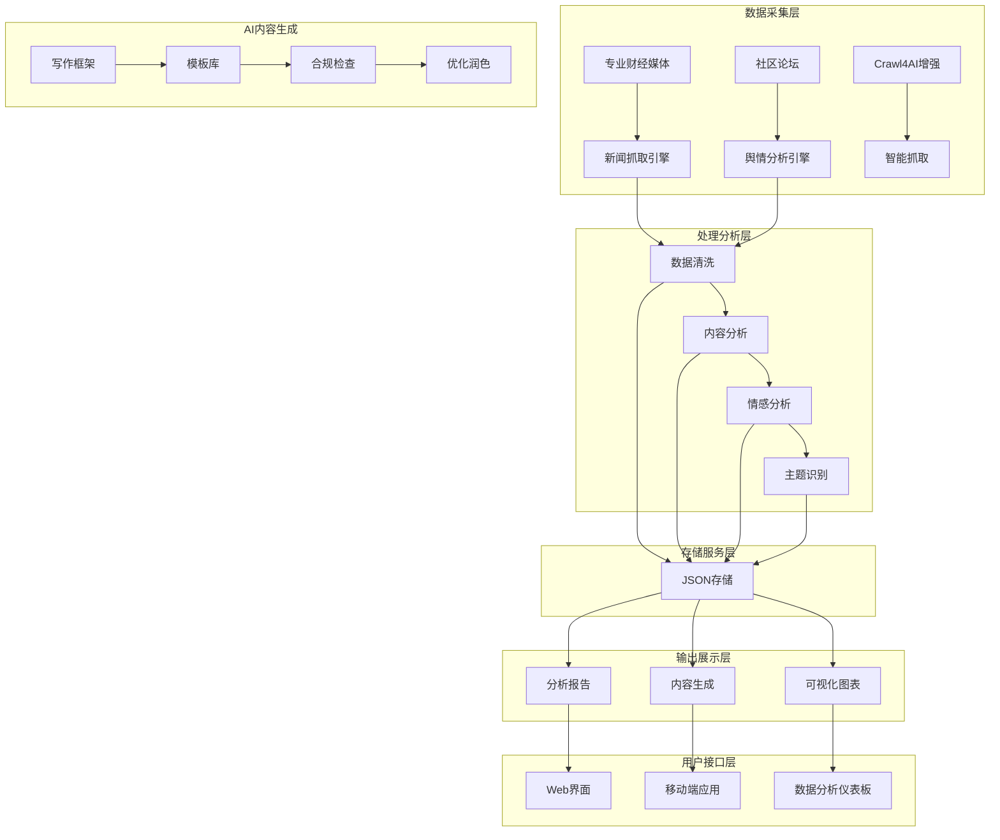
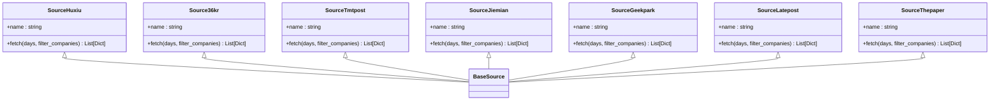
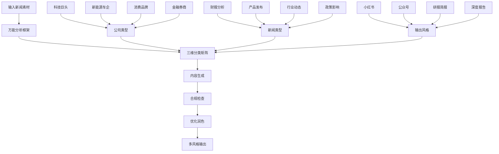
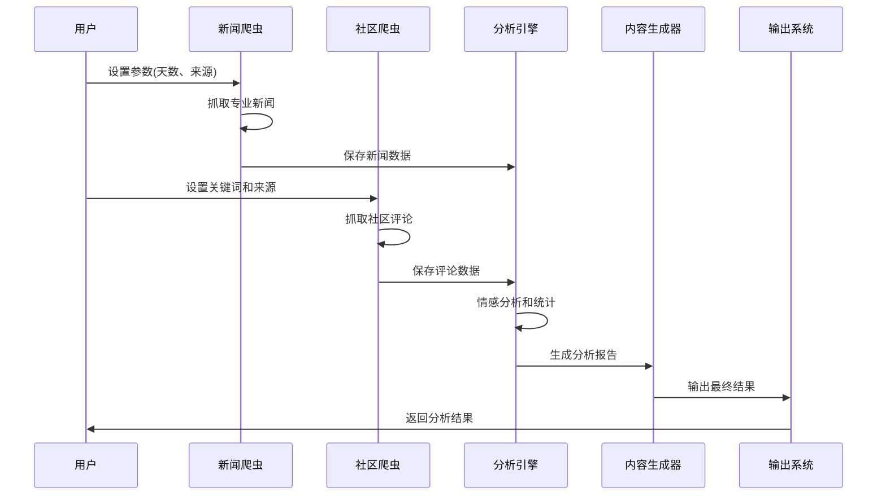

# 项目简介

<cite>
**本文档引用的文件**
- [RUN.md](file://docs/RUN.md)
- [requirements.txt](file://requirements.txt)
- [financial_news_workflow_crawl4ai.py](file://financial_news_workflow_crawl4ai.py)
- [community_crawler.py](file://community_crawler.py)
- [test_all_sources.py](file://test_all_sources.py)
- [test_crawl4ai.py](file://test_crawl4ai.py)
- [news_output_crawl4ai_20260324_102649/news_result.json](file://news_output_crawl4ai_20260324_102649/news_result.json)
- [news_output_crawl4ai_20260324_102649/prompt.txt](file://news_output_crawl4ai_20260324_102649/prompt.txt)
- [.agents/skills/china-financial-news-writer/SKILL.md](file://.agents/skills/china-financial-news-writer/SKILL.md)
- [design_philosophy.md](file://design/design_philosophy.md)
</cite>

## 目录
1. [项目概述](#项目概述)
2. [核心目标与使命](#核心目标与使命)
3. [解决的痛点问题](#解决的痛点问题)
4. [主要应用场景](#主要应用场景)
5. [价值定位与技术优势](#价值定位与技术优势)
6. [系统架构概览](#系统架构概览)
7. [核心组件详解](#核心组件详解)
8. [工作流程与数据流](#工作流程与数据流)
9. [差异化特点](#差异化特点)
10. [发展历程与团队介绍](#发展历程与团队介绍)
11. [未来发展规划](#未来发展规划)
12. [用户认知框架](#用户认知框架)

## 项目概述

Redbook金融新闻自动化工作流系统是一个面向中国金融市场的综合性新闻采集与分析平台。该项目致力于通过自动化技术解决金融新闻获取、分析和内容生产的痛点，为不同层次的用户提供从专业深度分析到大众化解读的全方位信息服务。

系统采用模块化设计，集成了专业财经媒体抓取、社区论坛舆情分析、AI内容生成等功能，形成了完整的金融信息生态系统。通过标准化的数据处理流程和智能化的内容分析，系统能够为用户提供及时、准确、有价值的投资决策参考信息。

## 核心目标与使命

### 核心目标
- **信息整合**：构建统一的金融新闻信息平台，整合多家权威媒体和社区资源
- **智能分析**：提供自动化的内容分析和投资机会识别能力
- **多层服务**：满足从专业分析师到普通投资者的不同需求层次
- **实时响应**：确保金融信息的时效性和准确性

### 使命
通过技术创新降低金融信息获取门槛，让专业的金融分析能力惠及更广泛的用户群体，推动中国金融市场信息透明化和专业化发展。

## 解决的痛点问题

### 信息碎片化
传统金融信息获取面临信息分散、重复、质量参差不齐的问题。系统通过统一的数据采集和标准化处理，有效解决了信息碎片化问题。

### 分析效率低下
人工分析金融新闻耗时耗力，难以满足高频交易和即时决策需求。系统提供自动化分析能力，显著提升信息处理效率。

### 内容质量不稳定
不同来源的内容质量差异较大，缺乏统一的质量标准。系统通过多维度分析框架和合规检查机制，确保输出内容的专业性和可靠性。

### 用户体验单一
传统金融信息服务往往过于专业化，普通投资者难以理解和应用。系统提供多层次、多风格的内容输出，适应不同用户群体的需求。

## 主要应用场景

### 财经媒体应用
为财经媒体提供自动化新闻采集和分析服务，支持深度报道的素材收集和背景研究。

### 投资分析应用
为投资分析师提供专业的市场动态跟踪和个股深度分析，辅助投资决策制定。

### 内容创作者应用
为内容创作者提供丰富的素材库和分析框架，支持财经类内容的创作和发布。

### 个人投资者应用
为普通投资者提供简化的金融信息解读和投资机会识别，帮助做出更明智的投资决策。

### 企业风控应用
为企业提供市场监测和舆情分析服务，辅助企业战略决策和风险管理。

## 价值定位与技术优势

### 价值定位
- **专业性**：提供深度的金融分析和专业的投资建议
- **时效性**：确保金融信息的实时更新和快速响应
- **准确性**：通过多源交叉验证和质量控制确保信息准确性
- **易用性**：提供简洁直观的操作界面和多样化的输出形式

### 技术优势
- **多源整合**：支持7大权威财经媒体和主要社区平台的数据采集
- **智能分析**：集成AI技术进行内容理解和情感分析
- **标准化流程**：建立完整的数据处理和质量控制体系
- **可扩展架构**：模块化设计支持功能扩展和性能优化

## 系统架构概览

**图表来源**
- [financial_news_workflow_crawl4ai.py:94-358](file://financial_news_workflow_crawl4ai.py#L94-L358)
- [community_crawler.py:82-496](file://community_crawler.py#L82-L496)
- [.agents/skills/china-financial-news-writer/SKILL.md:55-71](file://.agents/skills/china-financial-news-writer/SKILL.md#L55-L71)

## 核心组件详解

### 专业新闻抓取系统

系统集成了7大权威财经媒体的自动化抓取能力，包括虎嗅网、36氪、钛媒体、界面新闻、极客公园、晚点LatePost和澎湃新闻等。

**图表来源**
- [financial_news_workflow_crawl4ai.py:94-358](file://financial_news_workflow_crawl4ai.py#L94-L358)

### 社区舆情分析系统

系统提供社区论坛数据抓取和分析能力，支持雪球、知乎等平台的用户评论和讨论分析。

```mermaid
sequenceDiagram
participant User as 用户
participant Crawler as 社区爬虫
participant Parser as 内容解析
participant Analyzer as 情感分析
participant Storage as 数据存储
User->>Crawler : 输入关键词和参数
Crawler->>Parser : 抓取网页内容
Parser->>Analyzer : 提取评论文本
Analyzer->>Analyzer : 情感分析处理
Analyzer->>Storage : 保存分析结果
Storage->>User : 返回分析报告
```

**图表来源**
- [community_crawler.py:501-595](file://community_crawler.py#L501-L595)

### AI内容生成系统

基于万能分析框架的AI内容生成系统，支持多种输出风格和格式。

**图表来源**
- [.agents/skills/china-financial-news-writer/SKILL.md:24-52](file://.agents/skills/china-financial-news-writer/SKILL.md#L24-L52)

**章节来源**
- [financial_news_workflow_crawl4ai.py:94-358](file://financial_news_workflow_crawl4ai.py#L94-L358)
- [community_crawler.py:82-496](file://community_crawler.py#L82-L496)
- [.agents/skills/china-financial-news-writer/SKILL.md:55-71](file://.agents/skills/china-financial-news-writer/SKILL.md#L55-L71)

## 工作流程与数据流

### 完整工作流程

**图表来源**
- [docs/RUN.md:113-143](file://docs/RUN.md#L113-L143)

### 数据处理流程

系统采用标准化的数据处理流程，确保信息质量和处理效率：

1. **数据采集**：多源异构数据的统一采集和初步清洗
2. **内容分析**：基于万能分析框架的深度内容理解和结构化处理
3. **情感分析**：基于关键词匹配的社区舆情情感分析
4. **质量控制**：多维度的质量检查和合规性验证
5. **结果输出**：标准化的数据格式和多样化的展示形式

**章节来源**
- [docs/RUN.md:113-143](file://docs/RUN.md#L113-L143)
- [news_output_crawl4ai_20260324_102649/news_result.json:1-297](file://news_output_crawl4ai_20260324_102649/news_result.json#L1-L297)

## 差异化特点

### 技术差异化
- **多模态抓取**：支持RSS、API、Playwright等多种抓取方式
- **AI增强分析**：集成Crawl4AI进行智能内容提取和理解
- **情感智能**：基于中文语境的精准情感分析算法
- **合规保障**：内置敏感词检测和合规性检查机制

### 业务差异化
- **垂直专业化**：专注于中国金融市场和中文用户需求
- **多层次服务**：从专业深度分析到大众化解读的全覆盖
- **实时响应**：针对金融市场的时效性要求进行专门优化
- **生态整合**：与主流社交媒体和内容平台的深度集成

### 用户体验差异化
- **个性化定制**：支持用户自定义分析维度和输出格式
- **交互友好**：提供直观的操作界面和清晰的结果展示
- **多平台支持**：支持Web、移动端等多种访问方式
- **持续优化**：基于用户反馈进行功能迭代和改进

## 发展历程与团队介绍

### 发展历程

项目自启动以来，经历了从单一新闻抓取到综合性金融信息服务平台的发展过程：

- **初期阶段**：专注于专业财经媒体的数据采集和基础分析
- **扩展阶段**：增加社区论坛抓取和情感分析功能
- **智能化阶段**：集成AI技术和内容生成能力
- **生态化阶段**：构建完整的金融信息生态系统

### 团队构成

项目团队由多学科专业人才组成，包括：

- **技术开发团队**：负责系统架构设计和核心功能开发
- **数据分析师团队**：负责金融数据分析和算法优化
- **内容策划团队**：负责内容策略和用户体验设计
- **运维支持团队**：负责系统维护和性能优化

## 未来发展规划

### 短期规划（3-6个月）
- **功能完善**：优化现有功能，提升系统稳定性和性能
- **用户扩展**：扩大用户基础，增加用户反馈收集
- **生态建设**：完善合作伙伴关系，拓展数据来源

### 中期规划（6-12个月）
- **技术升级**：引入更先进的AI技术，提升分析能力
- **国际化**：扩展海外市场，支持多语言服务
- **商业化**：探索商业模式，实现可持续发展

### 长期愿景（1-3年）
- **行业领导**：成为中国领先的金融信息服务平台
- **技术创新**：在AI金融分析领域保持技术领先地位
- **生态繁荣**：构建完整的金融信息生态系统

## 用户认知框架

### 技术背景用户
对于有一定技术背景的用户，系统提供了：
- **技术细节**：详细的API文档和使用说明
- **扩展能力**：支持二次开发和功能定制
- **性能监控**：提供系统性能和使用情况监控

### 专业用户
针对专业用户群体，系统提供：
- **深度分析**：专业的财务分析和投资建议
- **定制服务**：个性化的分析维度和报告格式
- **专业工具**：专业的数据导出和分析工具

### 普通用户
面向普通用户，系统注重：
- **易用性**：简洁直观的操作界面和使用流程
- **实用性**：贴近用户需求的分析内容和解读
- **教育性**：提供金融知识普及和投资教育内容

通过以上多层次的设计，Redbook金融新闻自动化工作流系统能够满足不同用户群体的需求，为金融信息的获取、分析和应用提供全面的解决方案。